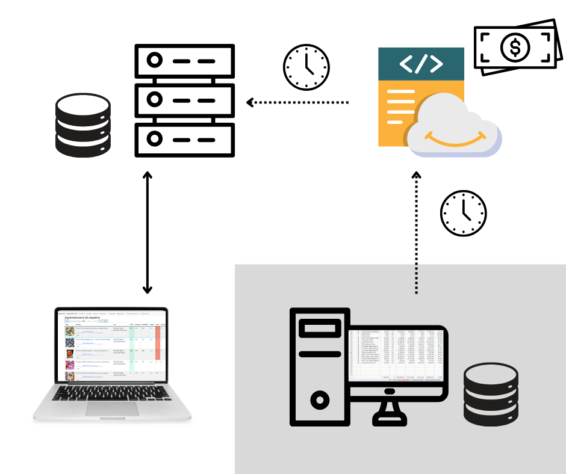
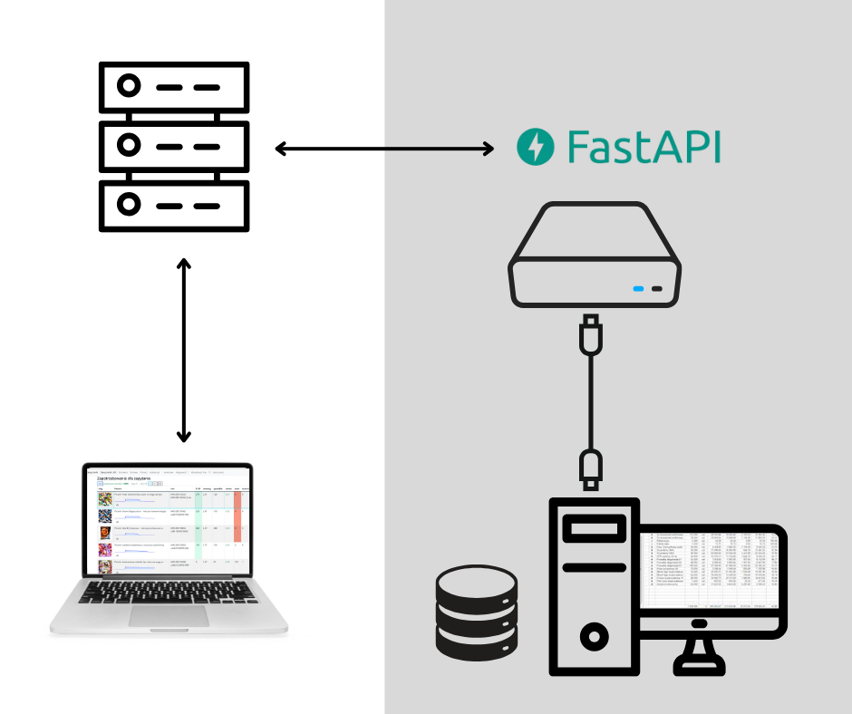

# Zakupoholik

Zakupoholik is an application designed to streamline the process of ordering products from suppliers. It is currently used by the online store [guiltfree.pl](https://guiltfree.pl). By analyzing sales data over a specified period, the application calculates the required quantities of each product to meet demand for a given number of days.

🎥 Check out this video demonstration: [Zakupoholik Demo](https://www.loom.com/share/cbf8bd1f25de42a5a802d840c9e0f067?sid=f544035c-2ec3-4806-84da-bea29c9c8162)

## How Zakupoholik Works

1. A **guiltfree.pl** employee selects a supplier or a brand they wish to order from.
2. The application analyzes sales data from a chosen period and calculates the required stock to cover demand for the next specified number of days (e.g., 30 days).
3. Zakupoholik presents the calculated demand in a structured table, displaying:
   - Sales velocity
   - A sales trend chart
   - Suggested order quantities
   - Estimated purchase cost

This system significantly improves efficiency and accuracy in restocking decisions, ensuring optimal stock levels while minimizing overstock and shortages.

---

## Case Study: Optimizing Data Synchronization

🎥 Check out this video demonstration: [Zakupoholik Fixed](https://www.loom.com/share/f60eaaa747284580b2ca0d37beaea1b3?sid=70b17c04-be04-4d19-9ef1-78a56e84791e)

### Initial Solution (Before Optimization)

Originally, all sales and delivery data were stored in a database managed by the **Subiekt** warehouse management system, running on a computer located in the **guiltfree.pl** warehouse. Data synchronization followed these steps:

1. Once a day, the system exported sales and delivery data and uploaded it to **AWS S3**.
2. Zakupoholik's server downloaded this data once a day and stored it in its local database.

**Problems with the initial approach:**
- **Outdated data:** The daily synchronization meant the data was often stale.
- **Slow synchronization:** The entire process was time-consuming.
- **Data inconsistencies:** Any modifications to historical records in **Subiekt** led to discrepancies between databases.
- **Unnecessary costs:** Using AWS S3 incurred costs that were avoidable.

### Improved Solution (Current Implementation)

To resolve these issues, we implemented a **real-time data retrieval system** using **FastAPI**:

1. A **separate Linux-based server** was set up in the warehouse, directly connected to the **Subiekt** database.
2. The server runs a **FastAPI service** that handles real-time queries.
3. Instead of syncing periodically, Zakupoholik now directly queries this Linux server whenever it needs sales data.

**Advantages of the new solution:**
✅ **Always up-to-date:** Data is fetched in real-time, ensuring accuracy.
✅ **Faster processing:** No more time-consuming daily syncs.
✅ **No inconsistencies:** All calculations are based on the current state of **Subiekt**.
✅ **Cost-effective:** Eliminated the need for AWS S3 storage.

### Before vs. After Infographics

**Previous Solution:**

**Current Solution:**

---

## Watch Zakupoholik in Action

🎥 Check out this video demonstration: [Zakupoholik Demo](https://www.loom.com/share/cbf8bd1f25de42a5a802d840c9e0f067?sid=f544035c-2ec3-4806-84da-bea29c9c8162)

---

Zakupoholik has transformed how **guiltfree.pl** manages its supplier orders, providing a more efficient, accurate, and cost-effective solution.

